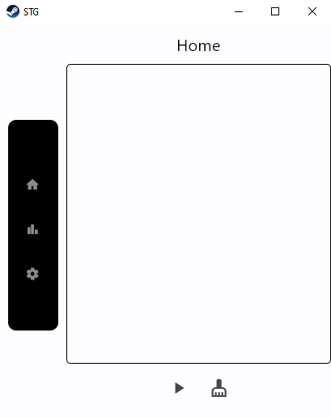
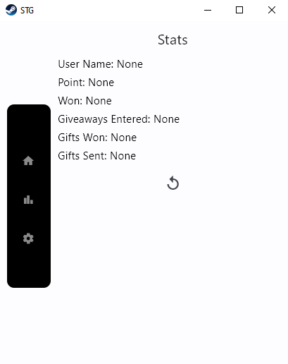
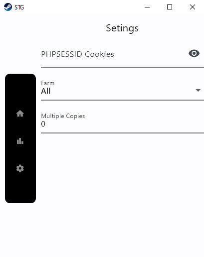

# SteamGifts-Bot
* Bot Version 1.0.4

## Bot launch
* We go to the site [SteamGifts](https://www.steamgifts.com/)
* Open the element code
* There we are looking for the Application tab
* Go to Cookies and find PHPSESSID there
* we take the value from PHPSESSID and enter it into the bot
